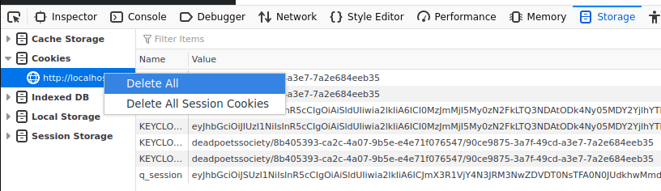

# voltaired

## Lancer les containers et les APIs

D'abord, on doit démarrer nos containers via le docker-compose :
```shell
docker compose up
```

Ensuite, il faut configurer notre keycloack pour obtenir le secret du client pour l'API user.
Aller dans `http://localhost:8765/auth/admin/master/console/#/deadpoetssociety/clients/f54c0c30-b86e-41de-9595-dd13244e3c97/credentials` puis
cliquer sur "Save". Régénérer le secret et le copier dans remplacer `application.properties` dans Java/src/main/resource.

```
quarkus.oidc.credentials.secret=<Generated secret>
```

Après, vous pouvez créer autant d'utilisateur que vous souhaitez sur http://localhost:8765/auth/admin/master/console/#/deadpoetssociety/users

Enfin, on peut lancer notre API Java : `cd Java && ./gradlew quarkusDev`

# Troubleshooting
> Je n'ai que des 401 sur l'API Java et j'ai l'erreur `ID token verification failure: io.quarkus.security.AuthenticationFailedException`.

Cela est du à un mauvais token de session. Il faut clear les cookies sur localhost : 
